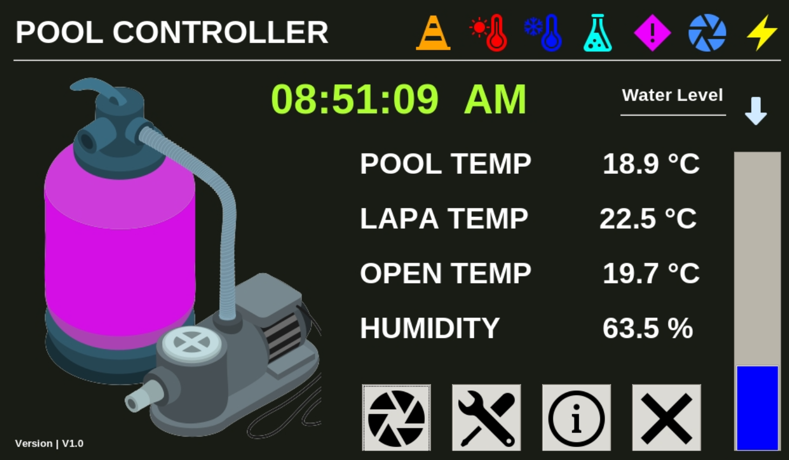

<h1>Pool Controller</h1>

<h6>Raspberry Pi Based SBC Controller to control your Pool and Pool Pump. </h6>
 

<h2>Overview</h2>

<h3>Control your swimming pool with this pool controller. Control the following:</h3>
<ul>
<li>Pool Temperature</li>
<li>Room Temperature</li>
<li>GEO Area  Temperature Via API</li>
<li>Room Humidity</li>
<li>Control Pool Pump</li>
<li>Chlorine Reminders</li>
<li>Pool filter sand replacement reminder</li>
<li>Hot or Cold Pool Temperature</li>
</ul>

<h2>Installation</h2>

To be Updated

